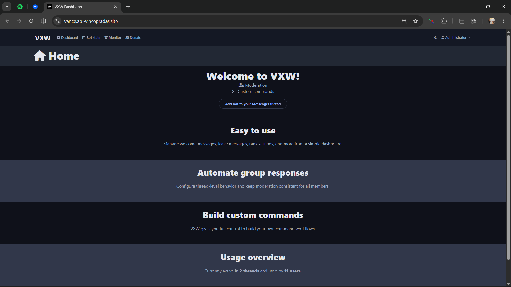
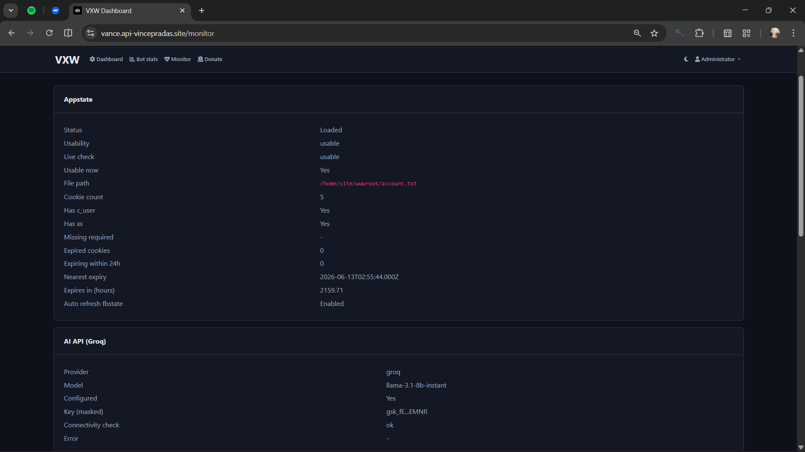
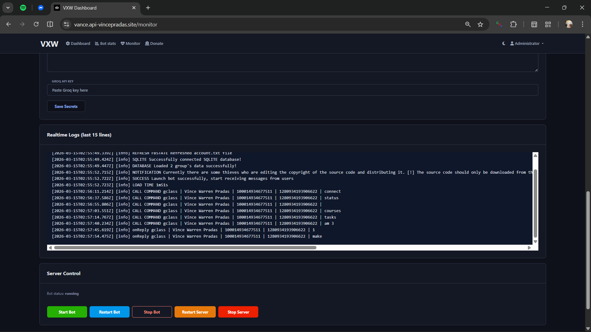
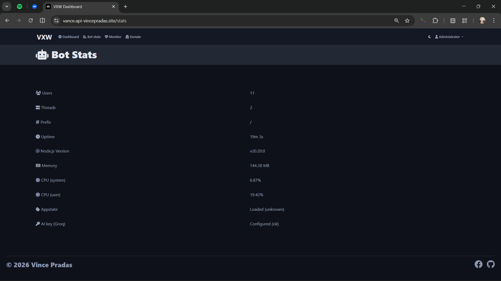

# Facebook Messenger Chatbot

Project documentation for `Facebook-Messenger-Chatbot`.

This project was forked from another repository. I modified it to fit my needs because internet access is a big problem for me at school. Since I spend a lot of time on Messenger, I thought it would be convenient if I could do most of my work there, especially since sending messages on Messenger is free.

For this reason, I forked the source code and customized it. It can now fetch my Google Classroom tasks and even automate submissions.

By deploying this on a cloud server, I can do things with my limited internet connection.

You can fork or clone this repository and modify it for your own use.







## 1. Project Overview

This project is a Node.js-based Messenger chatbot platform with:

- Messenger bot runtime
- Web dashboard for administration and monitoring
- Configurable command/event system
- Support for SQLite and MongoDB backends
- Azure deployment support through GitHub Actions

Primary runtime entrypoint:

- `index.js` -> launches `Goat.js`

Azure entrypoint:

- `start.azure.js` -> optional Playwright browser install + runtime start

## 2. Core Capabilities

- Messenger bot command/event handling
- Dashboard authentication and admin controls
- Runtime logs streaming in dashboard
- AppState/cookie health checks
- AI command integration via Groq-compatible settings
- Optional browser-based Facebook session refresh workflow

## 3. Tech Stack

- Node.js `>=20 <21`
- Express, Passport, Socket.IO
- SQLite (`sqlite3`) and MongoDB (`mongoose`) options
- Playwright (optional browser renew support)
- GitHub Actions + Azure Web App deploy pipeline

## 4. Repository Structure

Top-level important paths:

- `index.js`: process launcher
- `Goat.js`: main bootstrap and runtime setup
- `dashboard/`: dashboard app, routes, views, middleware
- `scripts/cmds/`: bot commands
- `scripts/events/`: event handlers
- `database/`: DB models/controllers/connectors
- `security/applyRuntimeSecrets.js`: environment variable to runtime config overlay
- `start.azure.js`: Azure runtime startup helper
- `.github/workflows/main_vance.yml`: CI/CD workflow
- `.env.example`: environment variable template

## 5. Prerequisites

- Node.js 20.x
- npm
- Facebook account/appstate workflow configured for your use case
- Optional: MongoDB instance if using MongoDB mode
- Optional: Azure Web App for cloud deployment

## 6. Local Development Setup

1. Install dependencies:

```bash
npm ci
```

2. Prepare config files:

- `config.json`
- `configCommands.json`

Use safe placeholders in git-tracked files. Inject real credentials via environment variables.

3. Start local runtime:

```bash
npm start
```

Optional modes:

```bash
npm run dev
npm run prod
```

## 7. Configuration Model

The project uses a layered config model:

1. Base JSON files:
- `config.json`
- `configCommands.json`

2. Runtime secret overlay from environment variables:
- implemented in `security/applyRuntimeSecrets.js`
- applied during bootstrap (`Goat.js`, `dashboard/connectDB.js`)

This allows public-safe repository configs while keeping real secrets outside git.

## 8. Environment Variables

Reference template: `.env.example`

### 8.1 Core Bot/Auth

- `FB_EMAIL`
- `FB_PASSWORD`
- `FB_2FA_SECRET`
- `FB_C_USER`
- `ADMIN_BOT_IDS` (comma or space separated)

### 8.2 Google / Email / OAuth

- `GMAIL_EMAIL`
- `GOOGLE_CLIENT_ID`
- `GOOGLE_CLIENT_SECRET`
- `GOOGLE_REFRESH_TOKEN`
- `GOOGLE_API_KEY`

### 8.3 AI / External Services

- `WEATHER_API_KEY`
- `GROQ_API_KEY`
- `GROQ_MODEL`
- `BINGX_API_KEY` (optional command)
- `BINGX_SECRET_KEY` (optional command)

### 8.4 Dashboard Security

- `SESSION_SECRET`
- `SESSION_COOKIE_SECURE`
- `DASHBOARD_ADMIN_USER`
- `DASHBOARD_ADMIN_PASSWORD`

## 9. Dashboard Security Behavior

Important behavior in `dashboard/app.js`:

- No default hardcoded `admin/admin` user
- Initial admin bootstrap requires:
  - `DASHBOARD_ADMIN_USER`
  - `DASHBOARD_ADMIN_PASSWORD`
- Session secret supports explicit `SESSION_SECRET`
- Secure cookie behavior configurable by environment and production mode

## 10. API and Health Endpoints

Examples:

- `GET /health`
- `GET /healthz`
- `GET /monitor` (authenticated admin)
- `GET /admin/system/logs` (authenticated admin)
- `GET /admin/system/logs/stream` (authenticated admin)
- `POST /admin/system/start` (authenticated admin)
- `POST /admin/system/restart` (authenticated admin)
- `POST /admin/system/stop` (authenticated admin)

## 11. Azure Deployment

Pipeline file:

- `.github/workflows/main_vance.yml`

Workflow highlights:

- Node.js 20 setup
- `npm ci --omit=dev` with retry behavior
- Deploy package creation with sensitive/runtime artifacts excluded
- Azure deploy action with publish-profile secret

Required GitHub secret for current workflow:

- `AZUREAPPSERVICE_PUBLISHPROFILE_4039FC4023204AF0BCBF4E6713A81172`

Recommended Azure App Settings:

- All variables from `.env.example` that your enabled features require

## 12. Security and Public Repository Guidance

Required rules:

- Never commit live credentials, tokens, appstate, cookies, browser profile data, or production databases
- Keep only placeholders in tracked config files
- Store runtime secrets in:
  - Azure App Settings
  - GitHub repository/environment secrets
  - Local untracked environment files

Current ignore protections are defined in `.gitignore` for sensitive runtime artifacts.

## 13. Operational Notes

- `config.json` and `configCommands.json` are still required as structural config files
- Sensitive values can remain blank in git
- Runtime overlay fills these from environment variables during startup
- If a feature requires a credential and it is missing, that feature may fail at runtime

## 14. Troubleshooting

### 14.1 CI install failure at `youtube-dl-exec`

Symptom:

- `npm ci` fails in GitHub Actions due to API rate limits

Mitigation:

- Workflow already provides `GH_TOKEN` / `GITHUB_TOKEN` from `${{ github.token }}`
- Includes retry attempts for transient failures

### 14.2 Dashboard inaccessible or no admin user

Check:

- `DASHBOARD_ADMIN_USER`
- `DASHBOARD_ADMIN_PASSWORD`
- `SESSION_SECRET`

Restart after setting values.

### 14.3 Browser renew issues on Azure

Check:

- `facebookAccount.browserRenew.enable` in `config.json`
- Playwright installation logs from `start.azure.js`
- `PLAYWRIGHT_BROWSERS_PATH` compatibility for Linux/Windows behavior

## 15. License

This project is licensed under the MIT License. See `LICENSE` for details.

## 16. Maintainer Notes

If you plan to make this repository public:

1. Rotate all previously exposed credentials before publishing.
2. Verify git history contains no sensitive blobs.
3. Keep this documentation and `.env.example` as the single source of setup truth.

